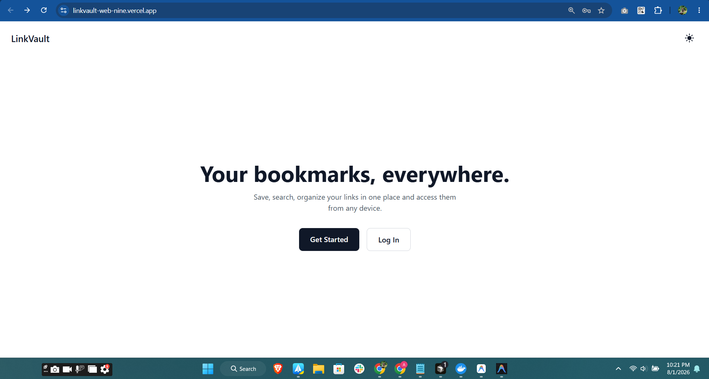
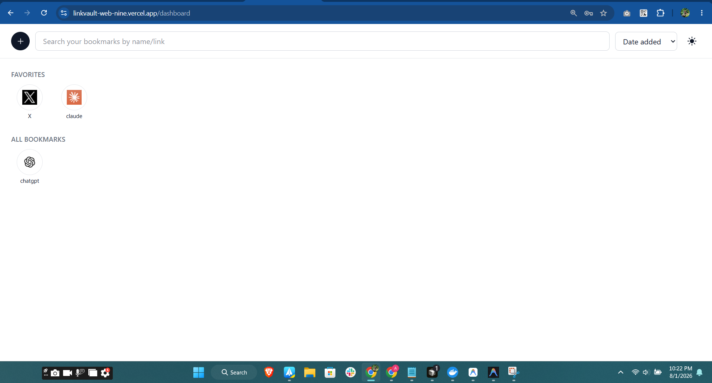
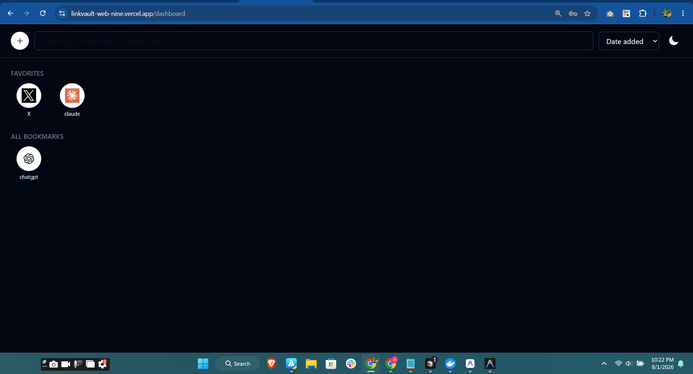
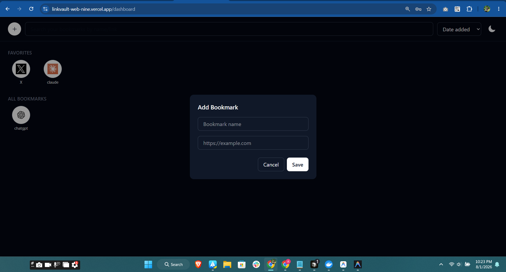
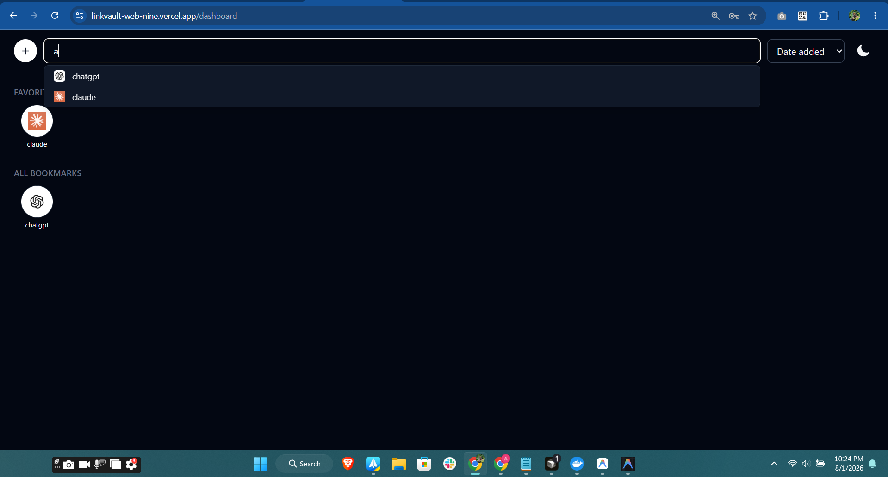

# LinkVault

A bookmarks manager with auto-fetched favicons, live search suggestions, favorites, and dark mode.

**Live site:** https://linkvault-web-nine.vercel.app
**Backend API:** https://linkvault-api-fbdv.onrender.com ([source](https://github.com/davidtiger3622/linkvault-api))

> Note: the backend runs on Render's free tier, which spins down after inactivity. The first request after idle time may take up to 50 seconds to respond.

## Screenshots

### Landing page


### Dashboard



### Adding a bookmark


### Live search suggestions


## Features

- Register / login with JWT auth and automatic token refresh
- Save bookmarks with auto-fetched favicons
- Live search suggestions as you type, sorted alphabetically
- Sort all bookmarks by date added or alphabetically
- Mark bookmarks as favorites, shown in a separate row
- Duplicate-link detection
- Dark / light mode toggle
- Forgot / reset password via email
- Fully responsive

## Tech Stack

- **Framework:** Next.js (App Router)
- **Styling:** Tailwind CSS
- **Language:** TypeScript
- **Testing:** Jest + React Testing Library
- **CI:** GitHub Actions (lint, test, build on every push)
- **Deployment:** Vercel

## Local Setup

```bash
git clone https://github.com/davidtiger3622/linkvault-web.git
cd linkvault-web
npm install
cp .env.example .env.local
# set NEXT_PUBLIC_API_URL to your backend URL
npm run dev
```

Runs on http://localhost:3000. Requires [linkvault-api](https://github.com/davidtiger3622/linkvault-api) running for full functionality.

Run tests:
```bash
npx jest
```

## License

MIT — see [LICENSE](LICENSE).
